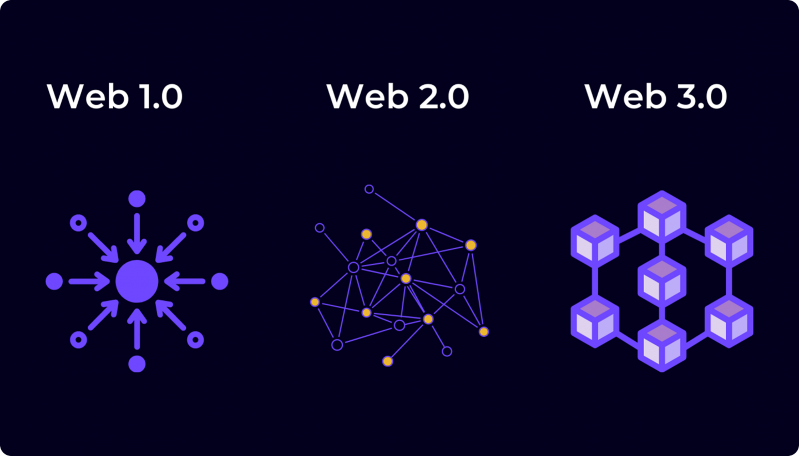

# Nome do projeto




> Esse é um projeto de estudos com a finalidade de entender o funcionamento da Web3 e a forma que resolvi fazer isso foi através da construção de uma Blockchain.

### Ajustes e melhorias

O projeto ainda está em desenvolvimento e as próximas atualizações serão voltadas para as seguintes tarefas:

- [x] Consentimento "Proof of work".
- [x] Servidor Peer to peer (P2P).
- [ ] Transação entre peers diferentes.
- [ ] Contratos inteligêntes.
- [ ] Aplicação de algum conceito de privacidade como o ZKP.
- [ ] Consentimento "Proof of stake".

## 💻 Pré-requisitos

Antes de começar, verifique se você atendeu aos seguintes requisitos:

- Você precisa da versão `20.15.1` ou superior do `Node.js`
- Você precisa da versão `10.7.0` ou superior do `npm`

## 🚀 Instalando os projetos

Cada projeto precisa ser instalado de forma individual, dentro das pastas dos projetos tem outro REAME ensinando a instala-los, mas para entrar pode usar.

```
$ cd <nome-do-projeto>
```