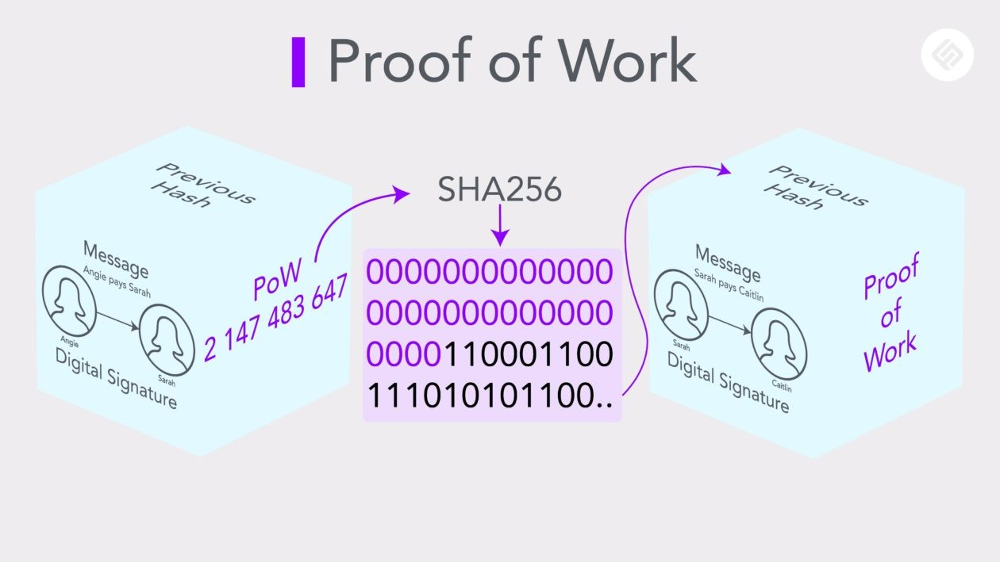

# Proof of work



> A blockchain tem algumas formas de provar a transferência entre 2 peers, elas são basicamente um "emprego" para computadores, serve basicamente para verificar as transações e expor os dados de forma desacoplada.

> A Mineração ou "Proof of work" em sí é basicamente uma forma de adicionar dificuldade e permitir um controle da taxa que esses dados são expostos.

### Ajustes e melhorias

O projeto ainda está em desenvolvimento e as próximas atualizações serão voltadas para as seguintes tarefas:

- [x] Criar novos blocos.
- [X] Minerar blocos.
- [X] Validar a cadeia de blocos.

## 💻 Pré-requisitos

Antes de começar, verifique se você atendeu aos seguintes requisitos:

- Você precisa da versão `20.15.1` ou superior do `Node.js`
- Você precisa da versão `10.7.0` ou superior do `npm`

## 🚀 Instalando "Proof of work"

Para instalar o "proof of work", siga estas etapas:

Linux e macOS:

```
$ npm install
$ npm run start
```

## ☕ Usando "Proof of work"

Não tem uma documentação mas no "index.ts" você pode modificar o nivel de dificuldade em:

```
new BlockchainService(<dificuldade>);
```

E tambem modificar o nome e a quantidade de mineradores (lembrando que é um projeto parcial, não tem diversos peers).
```
const miner<numero do minerador> = new MinerService(blockchain, <nome do minerador>);
```